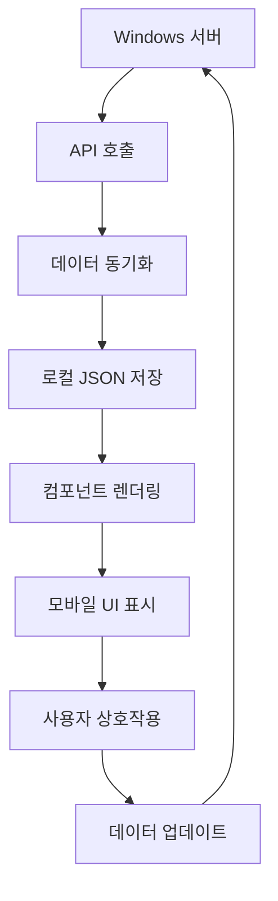

# VF 생산 계획 모바일 UI 개선 프로젝트

## 개요
VF 프로젝트의 생산 계획 페이지를 모바일 환경에서 더 효과적으로 사용할 수 있도록 UI/UX를 개선하는 프로젝트입니다.

## 목표
1. 모바일에서의 색상 식별성 향상
2. 수량 정보의 직관적 표시 (낱개 → 박스 → 팔레트)
3. 실시간 작업량 추적 및 진행률 표시
4. 작업 오류 최소화

## 진행 상황
- **현재 단계**: 주요 컴포넌트 구현 완료
- **완료율**: 80%
- **다음 단계**: Git 동기화 및 Windows 앱 통합

## 관련 문서

### 📁 핵심 문서
- [[VF-생산-계획-최종-색상-매핑]] - 최종 색상 컬러 매핑 테이블
- [[VF-생산-계획-색상-매핑]] - 원본 색상 데이터
- [[mobile-card-spec]] - 모바일 카드 컴포넌트 명세서

### 🔧 기술 문서
- [[vf_production_mobile_ui_test_report]] - Claude Code 테스트 보고서
- [[vf_mobile_ui_mockups]] - UI 모형 및 목업

### 💾 데이터 파일
- `vf_production_data.json` - Windows 서버 동기화 데이터
- `vf_master_specs.json` - 마스터 스펙 데이터

## 구현된 컴포넌트

### 🎨 색상 시스템
- **방안 A 적용**: 텍스트+배경 컬러링
- **화이트/아이보리 구분**: 특별 처리
- **색상 매핑**: 50+ 색상에 대한 HEX 코드 배정

### 📊 수량 계산 시스템
- **변환 로직**: 낱개(pcs) → 박스 → 팔레트
- **제품별 설정**: 40+ 제품의 박스당 수량 정의
- **진행률 계산**: 실시간 작업량 추적

### 📱 모바일 컴포넌트
1. **ProgressBar** - 진행률 바
2. **StatusIndicator** - 상태 표시기
3. **ProgressCard** - 통합 진행 카드
4. **MobileProductionCard** - 모바일 최적화 카드

## 기술 스택
- **언어**: TypeScript
- **프레임워크**: React
- **스타일링**: CSS-in-JS (styled-jsx)
- **빌드 도구**: (VF 프로젝트에 따라 결정)
- **데이터 소스**: Windows 서버 REST API

## Claude Code 활용
- **연결 방법**: `claude --permission-mode bypassPermissions --print`
- **구현 방식**: 순차적 작업 위임
- **검토 과정**: 구현 후 코드 품질 검토

## 데이터 흐름

## 테스트 계획
1. **단위 테스트**: 개별 컴포넌트 기능 검증
2. **통합 테스트**: 데이터 연동 테스트
3. **모바일 테스트**: 실제 모바일 환경에서 UI 검증
4. **사용성 테스트**: 현장 작업자 피드백 수집

## 배포 계획
1. **개발 환경**: 로컬 테스트 완료
2. **스테이징**: Windows 앱과의 통합 테스트
3. **프로덕션**: 실제 VF 프로젝트 적용

## 위험 요소 및 대응
| 위험 요소 | 가능성 | 영향도 | 대응 방안 |
|-----------|--------|--------|-----------|
| 색상 불일치 | 중 | 높 | 현장 검증 및 조정 |
| 데이터 동기화 실패 | 중 | 중 | 재시도 및 오류 처리 |
| 모바일 호환성 문제 | 낮 | 중 | 반응형 디자인 강화 |
| 성능 저하 | 낮 | 낮 | 코드 최적화 및 캐싱 |

## 팀 구성
- **프로젝트 관리**: 주현 김
- **기술 구현**: Claude Code + OpenClaw Assistant
- **검증 및 테스트**: 현장 작업자
- **데이터 관리**: Windows 서버 관리자

## 연락처 및 참고
- **프로젝트 리더**: 주현 김 (Telegram: @주현_김)
- **기술 지원**: OpenClaw 시스템
- **데이터 소스**: Windows 서버 (bonohouse.p-e.kr:5174)
- **문서 저장소**: 옵시디언 + Git

## 변경 이력
| 날짜 | 버전 | 변경 내용 | 담당자 |
|------|------|-----------|--------|
| 2026-04-15 | 0.1 | 프로젝트 시작, 색상 조사 | 주현 김 |
| 2026-04-16 | 0.5 | 컴포넌트 구현 완료 | Claude Code |
| 2026-04-16 | 0.6 | 문서화 및 메모리 정리 | OpenClaw |

## 다음 회의
- **일정**: 구현 완료 후
- **목적**: 현장 테스트 계획 수립
- **참석자**: 주현 김, 현장 관리자, 기술 담당자

---
*이 문서는 자동으로 생성 및 업데이트됩니다. 주요 변경사항은 Git을 통해 추적됩니다.*