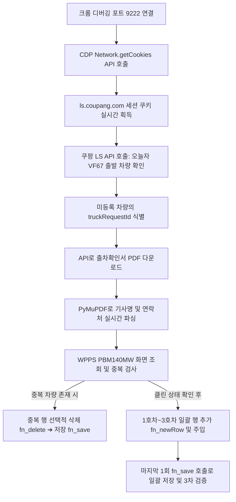

# WPPS-LS 출하통보등록 자동화 가이드 (올인원 에디션)

이 가이드는 쿠팡 LS(Linehaul Service)의 봇 차단을 우회하여 세션 쿠키를 실시간으로 자동 획득하고, WPPS PBM140MW 출하통보 화면에 최적화된 방식으로 데이터를 안전하게 일괄 등록하는 자동화 시스템에 대한 명세서입니다.

---

## 1. 시스템 개요 및 흐름

기존에는 사용자가 쿠팡 LS 사이트에 접속하여 `cookies.txt`를 수동으로 다운로드하고 복사해야 하는 불편함이 있었으나, 본 최적화 솔루션은 포트 `9222`에서 원격 디버깅 모드로 켜져 있는 크롬 브라우저 세션을 제어하여 **실시간 쿠키 자동 추출 및 일괄 저장**을 처리합니다.



---

## 2. 핵심 최적화 및 우회 기술

### ① CDP 기반 LS 쿠키 실시간 자동 추출
* **대상 도메인**: `https://ls.coupang.com`
* **우회 원리**: Akamai Bot Manager는 curl이나 봇 라이브러리가 전송하는 직접적인 로그인 POST 요청을 자격증명 에러로 속여 차단합니다. 이를 우회하기 위해 **사용자가 이미 로그인하여 인증 세션을 획득한 크롬 브라우저의 Cookie Storage에서 직접 쿠키를 추출**하여 재사용합니다.
* **효과**: 사용자의 수동 쿠키 복사 작업이 완전히 불필요해집니다.

### ② WPPS 일괄(Batch) 저장 최적화
* **기존 문제**: 차량 정보를 하나씩 넣을 때마다 `fn_save()`를 부르고 4초씩 대기하여 총 3회 이상(약 15초 소요)의 통신 병목과 다이얼로그 오버헤드가 발생했습니다.
* **최적화**: SpreadJS 메모리 버퍼 기능을 극대화하여 1~3호차 데이터를 그리드에 모두 주입(`setValue`)한 뒤, **마지막에 단 한 번만 `fn_save()`를 호출**하여 일괄 저장 처리합니다.

### ③ 중복 행 감지 및 선택적 선행 삭제
* **기존 문제**: KPP의 `.save` API는 중복 데이터를 그대로 추가로 밀어 넣을 수 있는 구조(중복 INSERT 버그)를 가지고 있으며, 조회 캐시 오류로 인해 이중 등록 사고가 빈번했습니다.
* **최적화**: 등록 작업 전 조회를 먼저 수행하고, 이미 2호차나 3호차의 차량번호가 그리드에 존재하는 경우 **해당 행들만 체크박스에 체크한 뒤 `fn_delete()` ➔ `fn_save()`를 실행하여 삭제한 뒤 재등록 프로세스에 진입**합니다. 이때, 이미 정상 완료된 1호차(`956464`)는 절대 건드리지 않도록 제외합니다.

---

## 3. 스크립트 정보 및 실행 방법

* **스크립트 파일 경로**: [wpps_register_2_3.py](file:///E:/coding/skill/KPP/wpps_register_2_3.py)
* **주요 의존성**: `pip install websocket-client pymupdf`

### 구동 방법
1. 원격 디버깅 포트 `9222`가 켜져 있는 크롬 브라우저를 확인합니다.
2. 브라우저에서 WPPS(wpps.logisall.net)에 로그인되어 있는지 확인합니다.
3. 터미널(PowerShell 등)을 열고 아래 스크립트를 구동합니다.
   ```bash
   python E:\coding\skill\KPP\wpps_register_2_3.py
   ```

---

## 4. 트러블슈팅 가이드 (Troubleshooting)

| 증상 | 원인 | 조치 사항 |
|---|---|---|
| `[ERROR] Chrome remote debugging이 켜져 있는지 확인하십시오.` | 크롬 브라우저가 디버깅 포트 9222로 실행되지 않음 | 크롬 바로가기 속성에 `--remote-debugging-port=9222` 옵션이 붙어 있는지 확인하고 재실행합니다. |
| `[WARN] 쿠팡 LS 쿠키를 획득하지 못했습니다.` | 브라우저 세션에서 쿠팡 LS 로그인이 풀려 있음 | 크롬 브라우저에서 `https://ls.coupang.com`에 접속하여 로그인을 수행하고 새로고침한 뒤 스크립트를 재실행합니다. |
| `[WARN] 첫 조회 결과가 0개입니다. (SpreadJS 초기화)` | SpreadJS 캐시 워밍 또는 데이터 바인딩 지연 | 스크립트가 자동으로 재조회를 시도하므로 대부분 자체 우회됩니다. 지속 시 브라우저에서 PBM140MW 탭을 새로고침하십시오. |
| `최종 등록 확인 결과 누락이 의심됩니다.` | 저장 시 다이얼로그 오작동 또는 통신 오류 | 브라우저 화면상의 그리드 상태와 저장된 디버깅용 스크린샷(`C:\Users\kis\AppData\Local\Temp\wpps_after_save.png`)을 직접 육안으로 확인합니다. |
